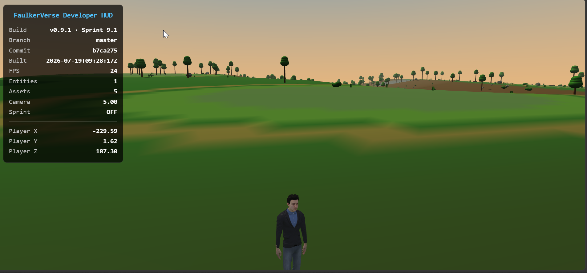

# FaulkerVerse

> Open-world third-person RPG built with Babylon.js.

## Current Gameplay



---

## Current Status

**Latest Build**
- Sprint: 9.4
- Branch: `master`
- Status: 🟢 Playable

### Completed

- ✅ Third-person camera
- ✅ Procedural terrain
- ✅ Trees, rocks, and environment spawning
- ✅ Waterways and lakes
- ✅ Mixamo character
- ✅ Developer HUD
- ✅ Boot diagnostics
- ✅ Animation state machine

FaulkerVerse is a custom third-person game engine built with Babylon.js.

The project is being developed incrementally using sprint-based milestones, with each sprint producing a stable checkpoint before moving on to the next feature set.

---

# Engine Architecture

```
Engine
│
├── World
│   ├── Scene
│   ├── Lighting
│   ├── Ground
│   └── Camera
│
├── Player
│
├── Input
│
├── CameraController
│
└── UI
```

### Design Goals

- Single source of truth for player movement.
- Camera follows the player.
- Character follows the player.
- Player never follows the camera.
- Modular systems with clear ownership.
- Configuration-driven engine behavior.
- Complete replacement files during development.

---

# Sprint Progress

## Sprint 9.1 — Build Identification

Completed

- Centralized Sprint 9.1 version metadata
- Generated Git branch, commit, and UTC build timestamp
- Build details displayed in the Developer HUD and startup log

Before packaging or deploying the game, refresh the generated build
information from the repository root:

```sh
./generate-build-info.sh
```

The game remains directly runnable as ES modules; the generated file is
committed so a fresh checkout does not require a build step.

---

## Sprint 1 — Engine Foundation

Completed

- Engine bootstrap
- Babylon.js integration
- Scene creation
- Lighting
- Ground
- Project structure

---

## Sprint 2 — Player

Completed

- Player entity
- Capsule placeholder
- Keyboard movement
- Run modifier
- Player rotation

---

## Sprint 3 — Camera Foundation

Completed

- Camera subsystem
- Camera configuration
- Camera controller architecture
- Camera update pipeline

---

## Sprint 4 — Perspective

Completed

- Third-person camera
- CameraController owns camera follow behavior
- ArcRotateCamera integration
- Mouse orbit
- Mouse wheel zoom
- Configuration-driven camera settings
- Camera smoothing foundation
- Stable Engine → CameraController → Camera update pipeline

### Current Limitations

- Camera is still an orbit camera.
- Movement is world-relative.
- Camera does not yet automatically stay behind the player.
- No camera collision.
- No shoulder offset.
- Placeholder capsule instead of animated character.

---

# Sprint 5 Goals

- Camera-relative movement
- Player rotation follows movement direction
- Character GLB import
- Animation controller
- Idle animation
- Walk animation
- Run animation

---

# Long-Term Roadmap

- Terrain streaming
- Vegetation
- Buildings
- Roads
- NPCs
- Vehicles
- Inventory
- Quests
- Save / Load
- Multiplayer investigation

---

# Development Workflow

Each sprint follows the same process:

1. Upload the current project ZIP.
2. Read the complete project before making changes.
3. Preserve the existing architecture unless a deliberate architectural change is approved.
4. Return complete replacement files only.
5. Verify functionality.
6. Commit and tag the sprint.
